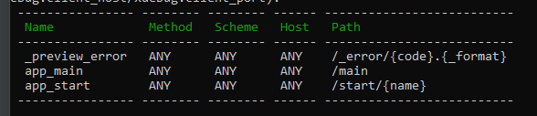

# Setting up a New Project
- Install Scoop
  - Set-ExecutionPolicy RemoteSigned -Scope CurrentUser (*Optional: Needed to run a remote script the first time*)
  - irm get.scoop.sh | iex
- Install the symfony CLI
  - scoop install symfony-cli
## Create the project
- composer create-project symfony/skeleton:"6.3.*" projectName
- OR symfony new my_project_directory --version="6.3.*"
## Add packages/services
- composer require --dev symfony/maker-bundle (*for the make command*)
- composer require symfony/twig-pack (*optional*)
- composer require --dev symfony/profiler-pack (*debug bar*)
## Setup Database and Entities
- composer require symfony/orm-pack (*Adds doctrine and annotations needed for routes*)
- Set the DATABASE_URL in the .env file. (*Add the database name you want to create and a username and password for a database user*).
- Run to create the database specified in the DATABASE_URL (*The user in the DATABASE_URL must have full privileges*):
  - php bin/console doctrine:database:create
### Adding Entities
- php bin/console make:entity (*enter the name of an existing entity to add additional properties*)
- enter the entity name (*singular*)
- (optional) enter the properties and their information from the command line (*entity can be altered later*)
- press enter when prompted to enter the entity name to finish creating the entity
- php bin/console make:migration (*Creates a php file in a migrations folder that contains the necessary sql commands to create/update the database.*)
  - OR php bin/console doctrine:schema:update -force (*It is recommended to use make:migration instead*)
- To run the migration that was just generated (*This will also add/update a migration table in your database to keep track of your migrations*):
  - php bin/console doctrine:migrations:migrate
### CRUD
- composer require symfony/validator (*required to use the next command*)
- composer require form security-csrf annotations (*also required*)
- php bin/console make:crud (*creates a controller, repository, and template files for each CRUD function*)
## Adding Controllers and Views
- php bin/console make:controller (if twig is installed, will also make the twig template file in a folder with the same name as the controller)
- name the controller (*must end with Controller*)
- To write to the database in your controller, inject the doctrine entity manager (**Doctrine/ORM/EntityManagerInterface**), call a method in the entity repository, and call flush to write it to the database.
- php bin/console debug:router (*to check your routes*).
### Adding forms
- composer require symfony/form
- php bin/console make:form (*Creates a form class; must have prefix Type*)
- composer require symfony/mime (*may be needed for uploading images*)
## Entity Relationships
- ex: **[ORM\ManyToOne(targetEntity: "App\Entity\Category", inversedBy: "dish")]**
  - inversedBy: is using the entity that contains the foreign key in the table. The table that contains the category is dish in the example.
  - mappedBy: used for the entity that contains many. ex: **[ORM\OneToMany(mappedBy: "category", targetEntity: "App\Entity\Dish")]**
- php bin/console make:entity (*set the field type to relation and answer the questions*)
- php bin/console make:entity --regenerate (*update the entity*)
- php bin/console make:migration (*update the database*)
---

## Rest API
Install the http-client package:
- composer require symfony/http-client

### Fetch data
**Make a request by calling the request function**:
```php
// GET
$response = $this->client->request(
    'GET',
    $this->restApiUrl . '/' . $id, [
        'headers' => [
            'Accept' => 'application/json',
            'Authorization: Bearer ' . $token
        ]
    ]
);
```

**Handle the request**:
```php
// Get the response as an array.
$data = $response->toArray();

// Get the raw response
// $data= $response->getContent();

$statusCode = $response->getStatusCode();
```

Process the status code in the controller class as necessary (returns statuse code as int).

(*$this refers to the AbstractController extended by the Controller class*)
```php
// Ex:
if ($epad['statusCode'] === 401) {
    // Unauthorized
} 
return $this->render('restapi_crud/index.html.twig', [
    'list' => $list['data'] ?? null,
]);
// Return as JSON if your application is a rest api 
return $this->json(
    $list
);
```

Display the data in the twig view
```html

  <tr>
    <td>{{ item.accountNumber }}</td>
    <td>{{ item.houseNumber }}</td>
    <td>{{ item.streetName }}</td>
  </tr>

```
### Post data
**Get the data from the form**:
```php
$form = $this->createForm(DataType::class, $data);
$form->handleRequest($request);
```
**Make a request by calling the request function**
```php
$response = $this->client->request(
    'POST',
    $this->restApiUrl . '/new', [
        'headers' => [
            'Content-Type' => 'application/json',
            'Authorization: Bearer ' . $token
        ],
        'json' => [
            "accountNumber" => $data->getAccountNumber(),
            "houseNumber" => $data->getHouseNumber(),
            "streetName" => $data->getStreetName(),
        ]
    ]
);
```
If the Content-Type is set to 'application/json', it is easier to use the json option instead of the body option or else you will need to encode the data to json format manually.

**Handle the request**:
```php
// Get the response as an array.
$data = $response->toArray();

// Get the raw response
// $data= $response->getContent();

$statusCode = $response->getStatusCode();
```
Process the status code in the controller class as necessary (returns statuse code as int).

($this refers to the AbstractController extended by the Controller class)
```php
 if ($epad['statusCode'] === 401) {
    // Unauthorized
} 
return $this->render('restapi_crud/index.html.twig', [
    'data' => $data ?? null,
]);
// Return as JSON if your application is a rest api 
return $this->json(
    $data
);
```
Display the data in the twig view
```html

  <tr>
    <td>{{ item.accountNumber }}</td>
    <td>{{ item.houseNumber }}</td>
    <td>{{ item.streetName }}</td>
  </tr>

```
---

# Security and Authentication
## Symfony
- composer require symfony/security-bundle (*required for the next step*)
- php bin/console make:user (*symfony authentication requires a user entity. The entity must be generated with this command, and not make:entity*)
- php bin/console make:auth (*sets up authentication. Login Form Authenticator will set up most of the functions for you*)
  - this process also adds code to the security.yaml file. Can optionally set the **encoders algorithm** to **argon2i** or **bcrypt**.
  - you can set access-control and restrict certain parts of your application to require certain roles in the security.yaml.
  - setting remember me will add entries to the security.yaml file.
- update the database:
  - php bin/console doctrine:schema:update --dump-sql --complete
  - php bin/console make:migration (*update the database*)
- Add a function to register/create account.
  - php bin/console make:controller RegisterController
## JWT
[Resource Link](https://www.binaryboxtuts.com/php-tutorials/symfony-6-json-web-tokenjwt-authentication/)
  
[Symfony docs](https://symfony.com/bundles/LexikJWTAuthenticationBundle/current/index.html)
- composer require jms/serializer-bundle
- composer require friendsofsymfony/rest-bundle
- composer require lexik/jwt-authentication-bundle
- uncomment the format_listener in the fos_rest.yaml file
- create the user entity
  - php bin/console make:user
- **run to create the public and private keys**:
  - mkdir config/jwt
  - php bin/console lexik:jwt:generate-keypair (*might not work*)
    - openssl genrsa -out config/jwt/private.pem -aes256 4096 (*will ask for the JWT_PASSPHRASE in .env*)
    - openssl rsa -pubout -in config/jwt/private.pem -out config/jwt/public.pem (*will also ask for JWT_PASSPHRASE*)
- add the following to routes.yaml
  - api_login_check:
    <br>path: /api/login_check
- add the necessary code to the security.yaml file.

---
# Routes
Routes are always defined for exactly one method in the controller.

Can be defined as an annotation, in the config/routes.yaml, in a xml file (*need to create a new file for config/routes.xml*), or as attributes (#[route]). Set to attributes by default.

You can add restrictions to routes to enforce http methods, and specify schemes, or hosts.



To reference the routes name in the view template file, use {{ path('routes_name') }}.

## Dealing with assets
Since the view templates aren't in the public folder, it is sometimes necessary to path directly to the public folder from the templates folder.
To avoid this, download:
- composer require symfony/asset

In the view templates, to reference assets located in the public folder, use:
- {{ assets('img/example.png') }}

---

# Local Domain Names
(Windows)<br/>
Go to Settings -> Network & Internet -> Proxy. Activate "Use setup script", enter http://127.0.0.1:7080/proxy.pac as the Script Address, and click save.

- Add the ssl certificate
  - symfony server:ca:install (*installs an SSL certificate and enables https*)
  - symfony proxy:start (*127.0.0.1:7080 shows all domains for the project*)
  - symfony proxy:domain:attach [domainname] (*set the new domain mame*)

## Activate the proxy server
- symfony proxy:start
- symfony proxy:domain:attach [domainname] (*set the new domain mame*)

---
# Good to Knows
- The order of route methods (in controllers) seems to matter. Put methods without ids in the routing parameters before ones that do.