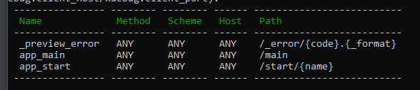

# Setting up a New Project
## Create the project
- composer create-project symfony/skeleton:"6.3.*" projectName
- OR symfony new my_project_directory --version="6.3.*"
## Add packages/services
- composer require --dev symfony/maker-bundle (*for the make command*)
- composer require symfony/twig-pack (*optional*)
- composer require --dev symfony/profiler-pack (*debug bar*)
## Setup Database and Entities
- composer require symfony/orm-pack (*Adds doctrine and annotations needed for routes*)
- Set the DATABASE_URL in the .env file. (*Add the database name you want to create and a username and password for a database user*).
- Run to create the database specified in the DATABASE_URL (*The user in the DATABASE_URL must have full privileges*):
  - php bin/console doctrine:database:create
### Adding Entities
- php bin/console make:entity (*enter the name of an existing entity to add additional properties*)
- enter the entity name (*singular*)
- (optional) enter the properties and their information from the command line (*entity can be altered later*)
- press enter when prompted to enter the entity name to finish creating the entity
- php bin/console make:migration (*Creates a php file in a migrations folder that contains the necessary sql commands to create/update the database.*)
  - OR php bin/console doctrine:schema:update -force (*It is recommended to use make:migration instead*)
- To run the migration that was just generated (*This will also add/update a migration table in your database to keep track of your migrations*): 
  - php bin/console doctrine:migrations:migrate
## Adding Controllers and Views
- php bin/console make:controller (if twig is installed, will also make the twig template file in a folder with the same name as the controller)
- name the controller (*must end with Controller*)
- To write to the database in your controller, inject the doctrine entity manager (**Doctrine/ORM/EntityManagerInterface**), call a method in the entity repository, and call flush to write it to the database.
- php bin/console debug:router (*to check your routes*).
### Adding forms
- composer require symfony/form
- php bin/console make:form (*Creates a form class; must have prefix Type*)
- composer require symfony/mime (*may be needed for uploading images*)
## Entity Relationships
- ex: **[ORM\ManyToOne(targetEntity: "App\Entity\Category", inversedBy: "dish")]**
  - inversedBy: is using the entity that contains the foreign key in the table. The table that contains the category is dish in the example.
  - mappedBy: used for the entity that contains many. ex: **[ORM\OneToMany(mappedBy: "category", targetEntity: "App\Entity\Dish")]**
- php bin/console make:entity (*set the field type to relation and answer the questions*)
- php bin/console make:entity --regenerate (*update the entity*)
- php bin/console make:migration (*update the database*)
## Security and Authentication
- composer require symfony/security-bundle (*required for the next step*)
- php bin/console make:auth (*sets up authentication*)
- php bin/console make:user (*symfony authentication requires a user entity. The entity must be generated with this command, and not make:entity*)
  - this process also adds code to the security.yaml file. Can optionally set the **encoders algorithm** to **argon2i** or **bcrypt**.
  - you can set access-control and restrict certain parts of your application to require certain roles in the security.yaml.
  - setting remember me will add entries to the security.yaml file.
- update the database:
  - php bin/console doctrine:schema:update --dump-sql --complete
  - php bin/console make:migration (*update the database*)
- Add a function to register/create account.
  - php bin/console make:controller RegisterController

---

# Routes
Routes are always defined for exactly one method in the controller.

Can be defined as an annotation, in the config/routes.yaml, in a xml file (need to create a new file for config/routes.xml), or as attributes (#[route]). Set to attributes by default.

You can add restrictions to routes to enforce http methods, and specify schemes, or hosts. 

To reference the routes name in the view template file, use {{ path('routes_name') }}.

## Dealing with assets
Since the view templates aren't in the public folder, it is sometimes necessary to path directly to the public folder from the templates folder.
To avoid this, download: 
- composer require symfony/asset

In the view templates, to reference assets located in the public folder, use:
- {{ assets('img/example.png') }}

---

# Local Domain Names
(Windows) 
Go to Settings -> Network & Internet -> Proxy. Activate "Use setup script", enter http://127.0.0.1:7080/proxy.pac as the Script Address, and click save.

## Activate the proxy server
- symfony proxy:start
- symfony proxy:domain:attach [domainname] (*set the new domain mame*)

---
# Good to Knows 
- The order of route methods (in controllers) seems to matter. Put methods without ids in the routing parameters before ones that do.